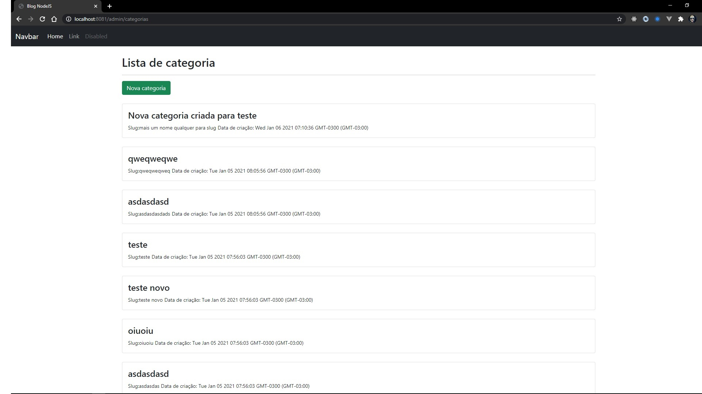

<h1 align="center">Blog app project 🥳</h1>

<h2 align="center">About 📖</h2>
   
   <p align="center">
      The blog app was developed along with the basic node.js course on YouTube, from <a href="https://www.youtube.com/playlist?list=PLJ_KhUnlXUPtbtLwaxxUxHqvcNQndmI4B">Guia do programador</a> channel.<br>
      
   </p>

- ✅ "Introduction to Node.JS" 💪
- 🔄 "building the application" 👀
- 🔄 "complete application" 📌

---

<h2 align="center">Preview 💻📱</h2>

   <p align="center">
      
   </p>

---

<h2 align="center">Layout 🎨</h2>

   <p align="center">
      The Layout was developed by Victor Lima</a>,

---

<h2 align="center">Functionalities 🛠️</h2>

- Create new category in the database
- Edit category in the database
- Delete category in the database

---

<h2 align="center">Technologies 🚀</h2>

- [Node.js](https://nodejs.org/en/)
- [Express](https://expressjs.com/pt-br/)
- [MongoDB](https://www.mongodb.com/)
- [Mongoose](https://mongoosejs.com/)
- [Handlebars](https://handlebarsjs.com/)
- [JavaScript](https://www.javascript.com/)
- [CSS](https://developer.mozilla.org/pt-BR/docs/Web/CSS)
- [Bootstrap](https://getbootstrap.com/)
- [HTML](https://html.com/)

---

<h2 align="center">How to Use 🤔</h2>

```
- Clone this repository:
$ git clone https://github.com/alexlopesbr/BlogApp.git

- Install dependencies:
$ npm install

- Connect mongo server (in another command line)
$ mongod

- Connect project server
$ nodemon app.js

```

---

<h2 align="center">How to Contribute 💪</h2>

```
- Fork the project

- Create a new branch with your changes:
$ git checkout -b my-feature

- Save your changes and create a commit message telling you what you did:
$ git commit -m "feature: My new feature"

- Submit your changes:
$ git push origin my-feature
```

---

<h2 align="center">License 📝</h2>

<p align="center">
   This repository is under MIT license. You can see the <a href="https://github.com/felipecastrosales/Happy/blob/master/LICENSE">LICENSE</a> file for more details. 😉
</p>

---

> This project was developed with ❤️ by **[@Alexandre Lopes](https://www.linkedin.com/in/aleflopes/)**, with the instructor **[Victor Lima](https://www.facebook.com/guiadoprogramadorbr/)** <br>
> If it helped you, give it ⭐, it will help me too 😉 The README design was kindly made available by **[@Felipe Sales](https://github.com/felipecastrosales)**

---

   <div align="center">

[](https://www.linkedin.com/in/aleflopes/)

   </div>
